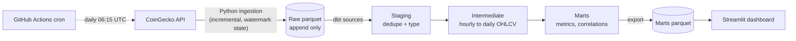

# Crypto Market Data Pipeline

An end to end ELT pipeline I built to practice the patterns used in real data engineering work. It pulls hourly crypto prices from the CoinGecko API, lands them as raw parquet files, models them into a warehouse with dbt on DuckDB, runs data tests, and serves the results to a Streamlit dashboard. A GitHub Actions cron refreshes everything daily, so the repo updates itself.



## How a run works

**1. Extract.** The run starts by asking what it already has. It reads `data/state/ingestion_state.json`, which stores the timestamp of the newest record per coin (the high watermark), then requests only data newer than that from the CoinGecko API. On the very first run there is no watermark, so it backfills 90 days. Every run after that fetches just the gap since last time. The API client handles rate limits with exponential backoff and retries server errors.

**2. Land raw.** Fetched rows are written as parquet files to `data/raw/`, named by load timestamp, and never touched again. Storing the data as close to how the source provided it means a bug in transformation logic is just a SQL fix and a rebuild, never lost data. The watermark only advances after a successful write, so a crashed run simply retries.

**3. Transform.** dbt reads the raw parquet as sources and builds the warehouse in layers. Staging casts types, filters garbage and deduplicates, since overlapping load windows can land the same hour twice and the latest load wins. The intermediate layer rolls 24 hourly points into one daily candle, where the first price of the day is the open and the last is the close. Marts are what an analyst would actually query.

**4. Test.** `dbt build` interleaves tests with models. If a staging test fails, downstream marts never build, so bad data is stopped at the gate instead of propagating. Tests cover grain uniqueness, nulls, positive prices, high never below low, and correlation bounds.

**5. Serve.** Marts are exported to `data/marts/*.parquet` so the dashboard, or anyone cloning the repo, can use the results without running the pipeline.

**6. Orchestrate.** GitHub Actions runs the whole sequence daily: unit tests, ingest, dbt build, export, then a commit of the new data. Because the watermark state is committed, every scheduled run continues exactly where the last one stopped.

In one sentence: extract incrementally using a watermark, land raw and immutable, transform in layered SQL with tests between layers, serve marts to consumers, and let a scheduler run it unattended.

## Design decisions

**Incremental ingestion.** Each run reads a high watermark per coin from `data/state/ingestion_state.json` and only requests data newer than that. Raw files are append only and never modified after landing. If two load windows overlap, the duplicates get resolved in staging, where the most recent load wins. This means a run can be repeated at any time without corrupting anything.

**Aggregation happens in SQL.** The free CoinGecko tier does not expose daily OHLC directly, but it returns hourly prices for windows up to 90 days. So the pipeline lands hourly points and dbt rolls them up into daily candles using `arg_min` and `arg_max` for open and close. I preferred keeping this logic in the warehouse rather than in Python, since that is where transformation logic belongs and where it is easiest to test.

**One incremental model, two full rebuilds.** `fct_daily_ohlcv` uses dbt incremental materialization with a delete and insert strategy keyed on coin and date. It reprocesses a three day lookback window on each run to catch late arriving hours and the day that was previously incomplete. The windowed marts (`fct_coin_metrics` and `fct_coin_correlations`) rebuild fully instead, because rolling metrics need complete history and the data volume makes a rebuild cheap. Choosing where incremental logic pays off, and where it does not, was the point of the exercise.

**Partial days are flagged, not dropped.** The current UTC day has fewer than 24 hourly points, so candles carry an `is_complete_day` flag. Rolling volatility and correlations only consume complete days, which keeps the metrics from being skewed by a half finished day.

**Tests at every layer.** pytest covers the watermark logic. Eighteen dbt tests cover grain uniqueness, nulls, a custom generic test for positive values, a sanity check that high is never below low, and bounds on correlation values.

## Warehouse layers

| Layer | Models | Purpose |
|---|---|---|
| staging | `stg_coingecko__prices`, `stg_coingecko__coins` | type, clean and deduplicate raw data |
| intermediate | `int_prices__daily_ohlcv` | roll hourly points up into daily candles |
| marts | `dim_coin`, `fct_daily_ohlcv`, `fct_coin_metrics`, `fct_coin_correlations` | returns, moving averages, annualized rolling volatility, drawdown, 30 day pairwise correlations |

## Running it

```bash
pip install -r requirements.txt
python main.py            # live run: ingest, dbt build, export marts
python main.py --sample   # offline run with synthetic data, no API needed
streamlit run dashboard/app.py
```

You can set `COINGECKO_API_KEY` with a free demo key for higher rate limits, but the pipeline also works without one since a full run only needs about 11 API calls.

Individual steps if you want them:

```bash
python -m ingestion.ingest                          # incremental ingest
cd dbt && dbt deps && dbt build --profiles-dir .    # models and tests
cd dbt && dbt docs generate --profiles-dir .        # lineage graph
python -m ingestion.export_marts                    # marts to data/marts/*.parquet
pytest tests/                                       # unit tests
```

## Orchestration

The workflow in `.github/workflows/pipeline.yml` runs daily at 06:15 UTC and can also be triggered manually. It runs the unit tests, does an incremental ingest, builds and tests the dbt project, exports the marts, and commits the new data back to the repo. Because the watermark state is committed, every scheduled run picks up exactly where the last one stopped.

## Repo layout

```
ingestion/          Python ingestion (API client, watermark state, landing)
dbt/                dbt project (staging, intermediate, marts, tests, docs)
data/raw/           landed parquet, append only, committed
data/state/         incremental watermarks, committed
data/marts/         exported analytics tables, committed, feeds the dashboard
data/warehouse/     DuckDB file, gitignored since it can be rebuilt from raw
dashboard/          Streamlit app
tests/              pytest unit tests
main.py             orchestrator: ingest, dbt build, export
```

## Known limitations and where I would take it next

The volume figure is CoinGecko's rolling 24 hour number snapshotted at day close, not true traded volume per day, since that is what the free tier offers. Backfill depth is capped at 90 days of hourly data for the same reason. Things I would add with more time: an orchestrator like Airflow or Dagster instead of cron, a Snowflake profile target, alerting when dbt tests fail, and dbt snapshots to track coin metadata as a slowly changing dimension.
